# 第一次实验-无人值守镜像安装

## 1.软件准备

一、VirtualBox

二、（有人值守）安装好的Ubuntu-18.04.3-server系统

三、Ubuntu-18.04.3-server.iso镜像

四、用于在虚拟机和本地之间传送文件的putty软件包

## 2.制作无人值守安装镜像

在虚拟机中使用 ifconfig 命令获取当前虚拟机的IP，如下图：

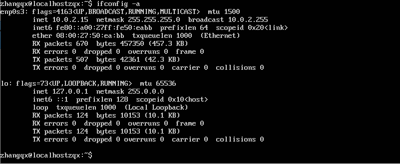

可以看到enp0s3的IP值为：10.0.2.15

使用软件putty建立虚拟机和主机的连接，如下图：

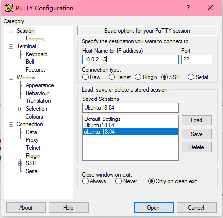

遇到了错误1，如下图所示：

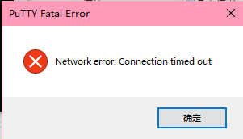

putty显示连接超时

查阅百度发现需要修改虚拟机的网卡1为桥接网卡，让虚拟机的IP地址的前缀和本地ip地址的前缀保持一致，如下图：

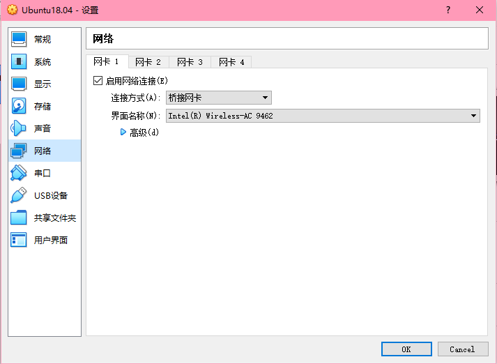

修改后获取的ep0s3的地址为192.168.1.106

然后使用putty进行连接，连接结果如下图：

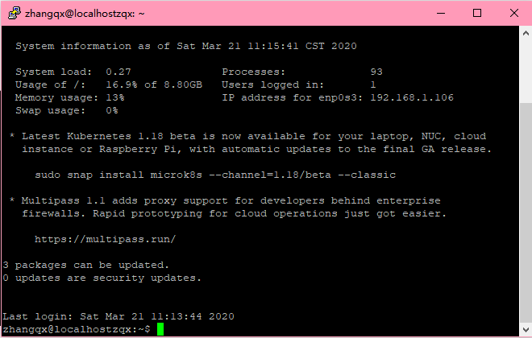

在虚拟机当中使用命令：

```
cd /home/
sudo mkdir cuc
```

在psftp软件中，使用如下代码将系统镜像光盘传输到虚拟机

```
open 192.168.1.106
cd /home/cuc
put ubuntu-18.04.4-server-amd64.iso
```

在执行以上操作的时候犯了一个低级错误，如下图：

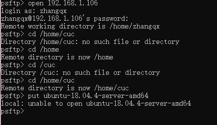

其实是文件名输入不全，为了防止这个问题发生，直接将文件名改为1.iso进行传输，如图：

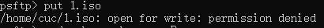

可以看到错误提示，虽然能够打开文件，但是没有传输权限，因此在虚拟机中运行代码

```
sudo chown -R zhangqx /home/cuc
```
来修改文件夹权限

结果如下：

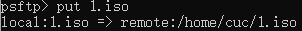

在工作目录下创建文件夹loopdir用于挂载iso文件，使用如下代码：
```
cd /home/cuc/
sudo mkdir loopdir
sudo mount -o loop 1.iso loopdir
```
创建工作文件夹cd，同步loopdir内容到文件夹cd，并卸载loopdir镜像，代码如下：
```
sudo mkdir cd
rsync -av loopdir/ cd
sudo umount loopdir
```
进入文件夹cd，并编辑Ubuntu安装引导界面的菜单项文件，代码如下：
```
cd cd/
sudo vim isolinux/txt.cfg
```
在文件中按i编辑，在default下面插入一下内容
```
label autoinstall
  menu label ^Auto Install Ubuntu Server
  kernel /install/vmlinuz
  append  file=/cdrom/preseed/ubuntu-server-autoinstall.seed debian-installer/locale=en_US console-setup/layoutcode=us keyboard-configuration/layoutcode=us console-setup/ask_detect=false localechooser/translation/warn-light=true localechooser/translation/warn-severe=true initrd=/install/initrd.gz root=/dev/ram rw quiet
```
并按esc键输入:wq!保存并强制退出

阅读课件上提供的preseed.cfg文档，以文本的格式保存在本地，对内容进行适当的修改以后，使用如下代码在虚拟机中创建自动安装seed文件
```
sudo vim preseed/ubuntu-server-autoinstall.seed
```
并在里面粘贴修改好的preseed.cfg文件的内容，保存并退出

使用代码
```
sudo vim isolinux/isolinux.cfg
```
将该文件中tomeout的值修改为10

使用命令
```
sudo su -
cd /home/cuc/cd && find . -type f -print0 | xargs -0 md5sum > md5sum.txt
```
重新生成md5sum.txt文件

使用命令：
```
IMAGE=custom.iso
BUILD=/home/cuc/cd/

mkisofs -r -V "Custom Ubuntu Install CD" \
-cache-inodes \
-J -l -b isolinux/isolinux.bin \
-c isolinux/boot.cat -no-emul-boot \
-boot-load-size 4 -boot-info-table \
-o $IMAGE $BUILD
```
将文件封装为custom.iso并保存在/home/cuc/cd的目录下，运行结果如图：
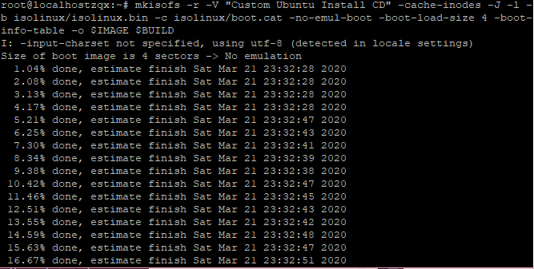
通过psftp获取光盘，如下图：
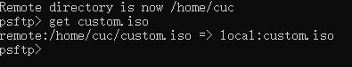
在本地文件夹中如下图：

## 3.测试光盘
在visualbox中新建一个虚拟机文件，并挂载好做好的光盘，如下图：
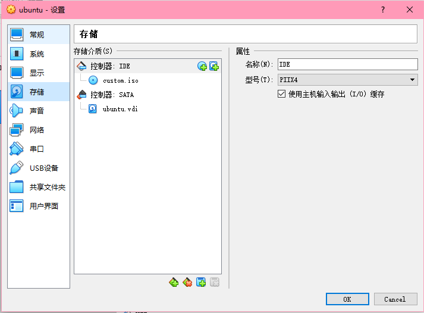
镜像成功运行，如下图：
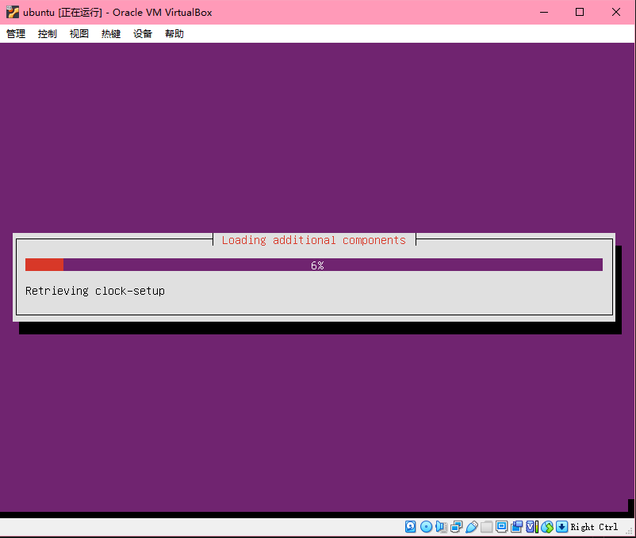
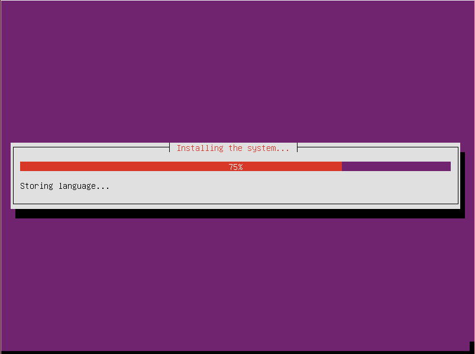
## 4.总结
本次实验大致了解了无人值守镜像安装的流程，并且明白了自动安装的光盘如何制作。通过修改preseed文件知道了在安装系统时需要的配置。也熟练的掌握了使用psftp在本地和虚拟机之间进行文件传输。
## 5.参考文献
[课程PPT](https://c4pr1c3.github.io/LinuxSysAdmin/chap0x01.exp.md.html#/3/1)

[csdn博客-Linux无人值守安装镜像制作](https://blog.csdn.net/qq_31989521/article/details/58600426)

